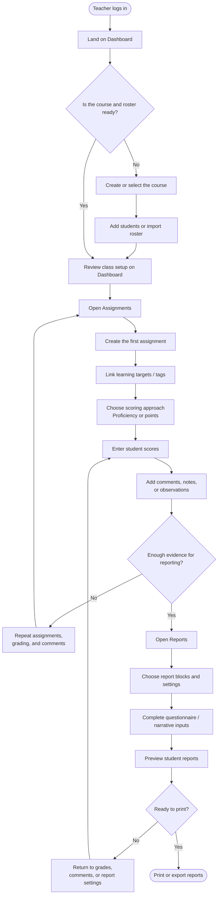
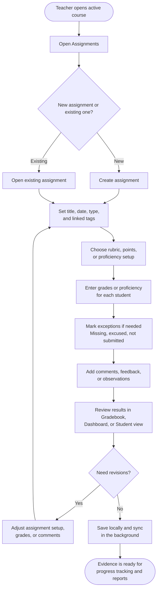

# Lucidchart User Flowcharts

These are Mermaid flowcharts prepared for Lucidchart:

- `lucidchart-first-time-report-flow.mmd`
- `lucidchart-teacher-assignment-comment-grade-flow.mmd`

## Flowchart 1

First-time teacher path from login to printed reports.

## Flowchart 2

Recurring teacher workflow for assignments, comments, and grades.

